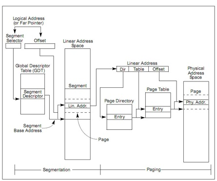

# 内存管理
[`1811363 洪一帆`]()

## 吐槽

>这个内容感觉有点多有点散，自己组织不大起来。
>
>比如很多函数好像看到过，但是忘记是干嘛的了。
>
>再比如很多的宏定义，使得原本已经复杂的内容更加复杂难以掌握。尽管可能是为了增加可读性，但是仅限于对程序结构有良好掌握的人而言。
>
>说到底还是自己对于ucore的掌握不够。



## my work
>练习3：释放某虚地址所在的页并取消对应二级页表项的映射（需要编程） 
>当释放一个包含某虚地址的物理内存页时，需要让对应此物理内存页的管理数据结构Page做
>相关的清除处理，使得此物理内存页成为空闲；另外还需把表示虚地址与物理地址对应关系
>的二级页表项清除。请仔细查看和理解page_remove_pte函数中的注释。为此，需要补全在
>kern/mm/pmm.c中的page_remove_pte函数。page_remove_pte函数的调用关系图如下所
>示：图2
>page_remove_pte函数的调用关系图
>请在实验报告中简要说明你的设计实现过程。
>
```c++
    if (*ptep&PTE_P) {                      //(1) check if this page table entry is present
        struct Page *page = pte2page(*ptep); //(2) find corresponding page to pte
        page_ref_dec(page);//(3) decrease page reference
        if(page->ref==0){
            free_page(page);
        }//(4) and free this page when page reference reachs 0
        *ptep=0;//(5) clear second page table entry清除二级页表项
        tlb_invalidate(pgdir,la);//(6) flush tlb
    }
```
>请回答如下问题：
>数据结构Page的全局变量（其实是一个数组）的每一项与页表中的页目录项pde和页表项pte有无对应关系？如果有，其对应关系是啥？
>   
>>有对应关系。
>>
>> /* *
     * struct Page - Page descriptor structures. Each Page describes one
     * **physical page**. 
     * */
>>
>>该变量为`extern struct Page *pages;`，其中标识着页目录项的起始地址， virtual address of physicall page array
>>
>>然后每一个page都包含着其物理地址`int ref;// page frame's reference counter`，
>>可以通过这个数组索引来寻找到物理页
>>
>>具体做法为将物理地址除以一个页的大小，然后乘上一个Page结构的大小获得偏移量，使用偏移量加上Page数组的基地址皆可以或得到对应Page项的地址；
>>
>>

>如果希望虚拟地址与物理地址相等，则需要如何修改lab2，完成此事？
>>
>>由于在完全启动了ucore之后，虚拟地址和线性地址相等，都等于物理地址加上0xc0000000，如果需要虚拟地址和物理地址相等，可以考虑更新gdt，更新段映射，使得virtual address = linear address - 0xc0000000，这样的话就可以实现virtual address = physical address；
>>
>>
>>


***
## 实验内容分析

>为了完成物理内存管理，这里首先需要探测可用的物理内存资源；了解到物理内存位于什么
地方，有多大之后，就以固定页面大小来划分整个物理内存空间，并准备以此为最小内存分
配单位来管理整个物理内存，管理在内核运行过程中每页内存，设定其可用状态（free的，
used的，还是reserved的），这其实就对应了我们在课本上讲到的连续内存分配概念和原理
的具体实现；接着ucore
kernel就要建立页表，
启动分页机制，让CPU的MMU把预先建立好
的页表中的页表项读入到TLB中，根据页表项描述的虚拟页（Page）与物理页帧（Page
Frame）的对应关系完成CPU对内存的读、写和执行操作。这一部分其实就对应了我们在课
本上讲到内存映射、页表、多级页表等概念和原理的具体实现。
在代码分析上，建议根据执行流程来直接看源代码，并可采用GDB源码调试的手段来动态地
分析ucore的执行过程。内存管理相关的总体控制函数是pmm_init函数，它完成的主要工作包
括：
>1. 初始化物理内存页管理器框架pmm_manager；
>2. 建立空闲的page链表，这样就可以分配以页（4KB）为单位的空闲内存了；
>3. 检查物理内存页分配算法；
>4. 为确保切换到分页机制后，代码能够正常执行，先建立一个临时二级页表；
>5. 建立一一映射关系的二级页表；
>6. 使能分页机制；
>7. 从新设置全局段描述符表；
>8. 取消临时二级页表；
>9. 检查页表建立是否正确；
>10. 通过自映射机制完成页表的打印输出（这部分是扩展知识）

### memlayout.h

- 定义page类及其属性：标志位、空闲块
- 内存的分段与组织
- 预定义的函数，主要用于对页表进行相应的操作
- 声明一个`free_area_t`，用于标明空闲页表
```c++
/* *
* Virtual memory map:                                          Permissions
*                                                              kernel/user
*
*     4G ------------------> +---------------------------------+
*                            |                                 |
*                            |         Empty Memory (*)        |
*                            |                                 |
*                            +---------------------------------+ 0xFB000000
*                            |   Cur. Page Table (Kern, RW)    | RW/-- PTSIZE
*     VPT -----------------> +---------------------------------+ 0xFAC00000
*                            |        Invalid Memory (*)       | --/--
*     KERNTOP -------------> +---------------------------------+ 0xF8000000
*                            |                                 |
*                            |    Remapped Physical Memory     | RW/-- KMEMSIZE
*                            |                                 |
*     KERNBASE ------------> +---------------------------------+ 0xC0000000
*                            |                                 |
*                            |                                 |
*                            |                                 |
*                            ~~~~~~~~~~~~~~~~~~~~~~~~~~~~~~~~~~~
* (*) Note: The kernel ensures that "Invalid Memory" is *never* mapped.
*     "Empty Memory" is normally unmapped, but user programs may map pages
*     there if desired.
*
* */

/* *
 * struct Page - Page descriptor structures. Each Page describes one
 * physical page. In kern/mm/pmm.h, you can find lots of useful functions
 * that convert Page to other data types, such as phyical address.
 * */
struct Page {
    int ref;                        // page frame's reference counter
                                    // ref表示这样页被页表的引用记数 （在“实现分页机制”一节会讲到）。如果这个页被页表引用了，即在某页表中有一个页表项设 置了一个虚拟页到这个Page管理的物理页的映射关系，就会把Page的ref加一；反之，若页表 项取消，即映射关系解除，就会把Page的ref减一。f
    uint32_t flags;                 // array of flags that describe the status of the page frame 这表示flags目前用到了两个bit表示页目前具有的两种属性，bit 0表示此页是否被保留 （reserved），如果是被保留的页，则bit 0会设置为1，且不能放到空闲页链表中，即这样的 页不是空闲页，不能动态分配与释放。
    unsigned int property;          // the num of free block, used in first fit pm manager，主要是我们可以设计不同的页分配算法（best fit, buddy system等），那么这个PG_property就有不同的含义了。
                                    //Page数据结构的成员变量property用来记录某连续内存空闲块的大小（即地址 连续的空闲页的个数）。这里需要注意的是用到此成员变量的这个Page比较特殊，是这个连 续内存空闲块地址最小的一页（即头一页， Head Page）。连续内存空闲块利用这个页的成
                                    //员变量property来记录在此块内的空闲页的个数。这里去的名字property也不是很直观，原因 与上面类似，在不同的页分配算法中，property有不同的含义。
    list_entry_t page_link;         // free list link Page数据结构的成员变量page_link是便于把多个连续内存空闲块链接在一起的双向链表指针 （可回顾在lab0实验指导书中有关双向链表数据结构的介绍）。这里需要注意的是用到此成员 变量的这个Page比较特殊，是这个连续内存空闲块地址最小的一页（即头一页， Head Page）。连续内存空闲块利用这个页的成员变量page_link来链接比它地址小和大的其他连续 内存空闲块。
};


/* free_area_t - maintains a doubly linked list to record free (unused) pages
 * 在初始情况下，也许这个物理内存的空闲物理页都是连续的，这样就形成了一个大的连续内 存空闲块。但随着物理页的分配与释放，这个大的连续内存空闲块会分裂为一系列地址不连 续的多个小连续内存空闲块，且每个连续内存空闲块内部的物理页是连续的。那么为了有效 地管理这些小连续内存空闲块。所有的连续内存空闲块可用一个双向链表管理起来，便于分 配和释放，为此定义了一个free_area_t数据结构，包含了一个list_entry结构的双向链表指针 和记录当前空闲页的个数的无符号整型变量nr_free。其中的链表指针指向了空闲的物理页。*/
typedef struct {
    list_entry_t free_list;         // the list header
    unsigned int nr_free;           // # of free pages in this free list
} free_area_t;
```

### mmu.h
主要存放各种descriptor

- 定义状态变量、常量
- 定义门
- 定义段：基址、段大小、段权限
- 定义进程状态：栈指针、段选择器
```
// A linear address 'la' has a three-part structure as follows:
//
// +--------10------+-------10-------+---------12----------+
// | Page Directory |   Page Table   | Offset within Page  |
// |      Index     |     Index      |                     |
// +----------------+----------------+---------------------+
//  \--- PDX(la) --/ \--- PTX(la) --/ \---- PGOFF(la) ----/
//  \----------- PPN(la) -----------/
```


### pmm.h (physical memory management)


```c++
// virtual address of boot-time page directory
extern pde_t *boot_pgdir;
// physical address of boot-time page directory
uintptr_t boot_cr3;

void pmm_init(void);

// pmm_manager is a physical memory management class. A special pmm manager - XXX_pmm_manager
// only needs to implement the methods in pmm_manager class, then XXX_pmm_manager can be used
// by ucore to manage the total physical memory space.
struct pmm_manager {
    const char *name;                                 // XXX_pmm_manager's name
    void (*init)(void);                               // initialize internal description&management data structure
                                                      // (free block list, number of free block) of XXX_pmm_manager 
    void (*init_memmap)(struct Page *base, size_t n); // setup description&management data structcure according to
                                                      // the initial free physical memory space 
    struct Page *(*alloc_pages)(size_t n);            // allocate >=n pages, depend on the allocation algorithm 
    void (*free_pages)(struct Page *base, size_t n);  // free >=n pages with "base" addr of Page descriptor structures(memlayout.h)
    size_t (*nr_free_pages)(void);                    // return the number of free pages 
    void (*check)(void);                              // check the correctness of XXX_pmm_manager ，用来编写测试函数
};
```

***
