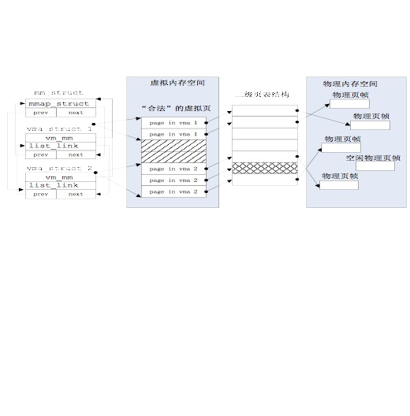

# lab3

## 关键问题

1. 当程序运行中访问内存产生page fault异常时，如何判定这个引起异常的虚拟地址内存访 问是越界、写只读页的“非法地址”访问还是由于数据被临时换出到磁盘上或还没有分配内 存的“合法地址”访问？ 

> 建立mm_struct和vma_struct数据结构，描述 了ucore模拟应用程序运行所需的合法内存空间
> 

2. 何时进行请求调页/页换入换出处理？

3. 如何在现有ucore的基础上实现页替换算法？

## 流程

在init总入口中可以看到执行顺序：

```c++
    vmm_init();                 // init virtual memory management
    ide_init();                 // init ide devices
    swap_init();                // init swap
```

1. **表述不在物理内存中的“合法”虚拟页:** 
   
   用数据结构来描述这样的页，为此ucore建立了mm_struct和vma_struct数据结构

   - vma_struct:描述应用程序对虚拟内存“需求”
        ```c++
        //描述每一个连续块
        // the virtual continuous memory area(vma)
        struct vma_struct {
            //vm_start和vm_end描述了一个连续地址的虚拟内存空间的起始位置和结束位置，这两个值都 应该是PGSIZE 对齐的，而且描述的是一个合理的地址空间范围（即严格确保 vm_start < vm_end的关系）
            struct mm_struct *vm_mm; // the set of vma using the same PDT 这个数据结构表示了包含所有虚拟内存空间的共 同属性
            uintptr_t vm_start;      //    start addr of vma    
            uintptr_t vm_end;        // end addr of vma
            uint32_t vm_flags;       // flags of vma
            list_entry_t list_link;  // linear list link which sorted by start addr of vma
        };

        //b+树，描述整个虚拟地址空间
        // the control struct for a set of vma using the same PDT
        struct mm_struct {
            list_entry_t mmap_list;        // linear list link which sorted by start addr of vma，链接了所有属于同一页目录表的虚拟内存空间
            struct vma_struct *mmap_cache; // current accessed vma, used for speed purpose,局部性
            pde_t *pgdir;                  // the PDT of these vma，pgdir 所指向的就是 mm_struct数据结构所维护的页表。通过访问pgdir可以查找某虚拟地址对应的页表项是否存在以及页表项的属性等。
            int map_count;                 // the count of these vma
            void *sm_priv;                   // the private data for swap manager。sm_priv指向用来链接记录页访问情况的链表头，这建立了 mm_struct和后续要讲到的swap_manager之间的联系。
        };
        ```

2. **缺页异常及其处理**

    首先页访问异常也是一种 异常，所以针对一般异常的硬件处理操作是必须要做的，即CPU在当前内核栈保存当前被打 断的程序现场，即依次压入当前被打断程序使用的EFLAGS，CS，EIP，errorCode；
    
    由于页 访问异常的中断号是0xE，CPU把异常中断号0xE对应的中断服务例程的地址（vectors.S中的 标号vector14处）加载到CS和EIP寄存器中，开始执行中断服务例程。

    _重点：do_pgfault函数会申请一个**空闲物理页**，并**建立好虚实映射关系**，从而使得这样的“合法”虚拟页有实际的物理页帧对应._

    _它根据从CPU的控制寄存器CR2 中获取的页访问异常的物理地址以及根据errorCode的错误类型来查找此地址**是否在某个VMA 的地址范围内以及是否满足正确的读写权限**，如果在此范围内并且权限也正确，这认为这是 一次合法访问，但没有建立虚实对应关系。所以需要分配一个空闲的内存页，并修改页表完 成虚地址到物理地址的映射，刷新TLB，然后调用iret中断，返回到产生页访问异常的指令处 重新执行此指令。如果该虚地址不在某VMA范围内，则认为是一次非法访问。_


3. **初始化硬盘交互**

    ide_init就是完成对用于页换入换出的硬盘（简称swap硬盘）的初始化工作。
    
    完成ide_init函 数后，ucore就可以对这个swap硬盘进行读写操作了

    **重点：**

    _当一个PTE用来描述一般意义上的**物理页**时， 显然它应该维护各种权限和映射关系，以及应该有PTE_P标记；_
    
    _**但当它用来描述一个被置换 出去的物理页时，它被用来维护该物理页与 swap 磁盘上扇区的映射关系**，并且该 PTE 不应 该由 MMU 将它解释成物理页映射(即没有**PTE_P(表示是否在物理内存中)**标记)，与此同时对应的权限则交由 mm_struct 来维护，当对位于该页的内存地址进行访问的时候，必然导致 page fault，然后 ucore能够根据 PTE 描述的 swap 项将相应的物理页重新建立起来，并根据虚存所描述的权限 重新设置好 PTE 使得内存访问能够继续正常进行。_

4. **实现swap：swap_init()**

    - swap_init函数首先建立 swap_manager，swap_manager是完成页面替换过程的主要功能模块，其中包含了页面置换 算法的实现

    ```c++
    struct swap_manager
    {
        const char *name;
        /* Global initialization for the swap manager */
        int (*init)            (void);
        /* Initialize the priv data inside mm_struct */
        int (*init_mm)         (struct mm_struct *mm);
        /* Called when tick interrupt occured */
        int (*tick_event)      (struct mm_struct *mm);
        /* Called when map a swappable page into the mm_struct 记录页访问情况相关属性 */
        int (*map_swappable)   (struct mm_struct *mm, uintptr_t addr, struct Page *page, int swap_in);
        /* When a page is marked as shared, this routine is called to
        * delete the addr entry from the swap manager */
        int (*set_unswappable) (struct mm_struct *mm, uintptr_t addr);
        /* Try to swap out a page, return then victim 挑选需要换出的页 */
        int (*swap_out_victim) (struct mm_struct *mm, struct Page **ptr_page, int in_tick);
        /* check the page relpacement algorithm */
        int (*check_swap)(void);     
    };

    int
    swap_init(void)
    {
        swapfs_init();//swap 分区的大 小是 swapfs_init 里面根据磁盘驱动的接口计算出来的

        if (!(1024 <= max_swap_offset && max_swap_offset < MAX_SWAP_OFFSET_LIMIT))
        {
            panic("bad max_swap_offset %08x.\n", max_swap_offset);
        }
        
        //记录页访问情况，哪些页可以换swapable，以及选择需要换出的页，采用FIFO算法
        sm = &swap_manager_fifo;
        int r = sm->init();
        
        if (r == 0)
        {
            swap_init_ok = 1;
            cprintf("SWAP: manager = %s\n", sm->name);
            check_swap();
        }

        return r;
    }
    ```

    - 然后会进一步调用执行check_swap函数在内核中分 配一些页，模拟对这些页的访问，这会产生页访问异常。（即检查是否正确）

    ```c++
    static void
    check_swap(void)
    {
        //backup mem env
        int ret, count = 0, total = 0, i;
        list_entry_t *le = &free_list;
        while ((le = list_next(le)) != &free_list) {
            struct Page *p = le2page(le, page_link);
            assert(PageProperty(p));
            count ++, total += p->property;
        }
        assert(total == nr_free_pages());
        cprintf("BEGIN check_swap: count %d, total %d\n",count,total);
        
        //now we set the phy pages env     
        struct mm_struct *mm = mm_create();
        assert(mm != NULL);

        extern struct mm_struct *check_mm_struct;
        assert(check_mm_struct == NULL);

        check_mm_struct = mm;

        pde_t *pgdir = mm->pgdir = boot_pgdir;
        assert(pgdir[0] == 0);

        struct vma_struct *vma = vma_create(BEING_CHECK_VALID_VADDR, CHECK_VALID_VADDR, VM_WRITE | VM_READ);
        assert(vma != NULL);

        insert_vma_struct(mm, vma);

        //setup the temp Page Table vaddr 0~4MB
        cprintf("setup Page Table for vaddr 0X1000, so alloc a page\n");
        pte_t *temp_ptep=NULL;
        temp_ptep = get_pte(mm->pgdir, BEING_CHECK_VALID_VADDR, 1);
        assert(temp_ptep!= NULL);
        cprintf("setup Page Table vaddr 0~4MB OVER!\n");
        
        for (i=0;i<CHECK_VALID_PHY_PAGE_NUM;i++) {
            check_rp[i] = alloc_page();
            assert(check_rp[i] != NULL );
            assert(!PageProperty(check_rp[i]));
        }
        list_entry_t free_list_store = free_list;
        list_init(&free_list);
        assert(list_empty(&free_list));
        
        //assert(alloc_page() == NULL);
        
        unsigned int nr_free_store = nr_free;
        nr_free = 0;
        for (i=0;i<CHECK_VALID_PHY_PAGE_NUM;i++) {
            free_pages(check_rp[i],1);
        }
        assert(nr_free==CHECK_VALID_PHY_PAGE_NUM);
        
        cprintf("set up init env for check_swap begin!\n");
        //setup initial vir_page<->phy_page environment for page relpacement algorithm 

        
        pgfault_num=0;
        
        check_content_set();
        assert( nr_free == 0);         
        for(i = 0; i<MAX_SEQ_NO ; i++) 
            swap_out_seq_no[i]=swap_in_seq_no[i]=-1;
        
        for (i= 0;i<CHECK_VALID_PHY_PAGE_NUM;i++) {
            check_ptep[i]=0;
            check_ptep[i] = get_pte(pgdir, (i+1)*0x1000, 0);
            //cprintf("i %d, check_ptep addr %x, value %x\n", i, check_ptep[i], *check_ptep[i]);
            assert(check_ptep[i] != NULL);
            assert(pte2page(*check_ptep[i]) == check_rp[i]);
            assert((*check_ptep[i] & PTE_P));          
        }
        cprintf("set up init env for check_swap over!\n");
        // now access the virt pages to test  page relpacement algorithm 
        ret=check_content_access();
        assert(ret==0);
        
        //restore kernel mem env
        for (i=0;i<CHECK_VALID_PHY_PAGE_NUM;i++) {
            free_pages(check_rp[i],1);
        } 

        //free_page(pte2page(*temp_ptep));
        
        mm_destroy(mm);
            
        nr_free = nr_free_store;
        free_list = free_list_store;

        
        le = &free_list;
        while ((le = list_next(le)) != &free_list) {
            struct Page *p = le2page(le, page_link);
            count --, total -= p->property;
        }
        cprintf("count is %d, total is %d\n",count,total);
        //assert(count == 0);
        
        cprintf("check_swap() succeeded!\n");
    }


    ```