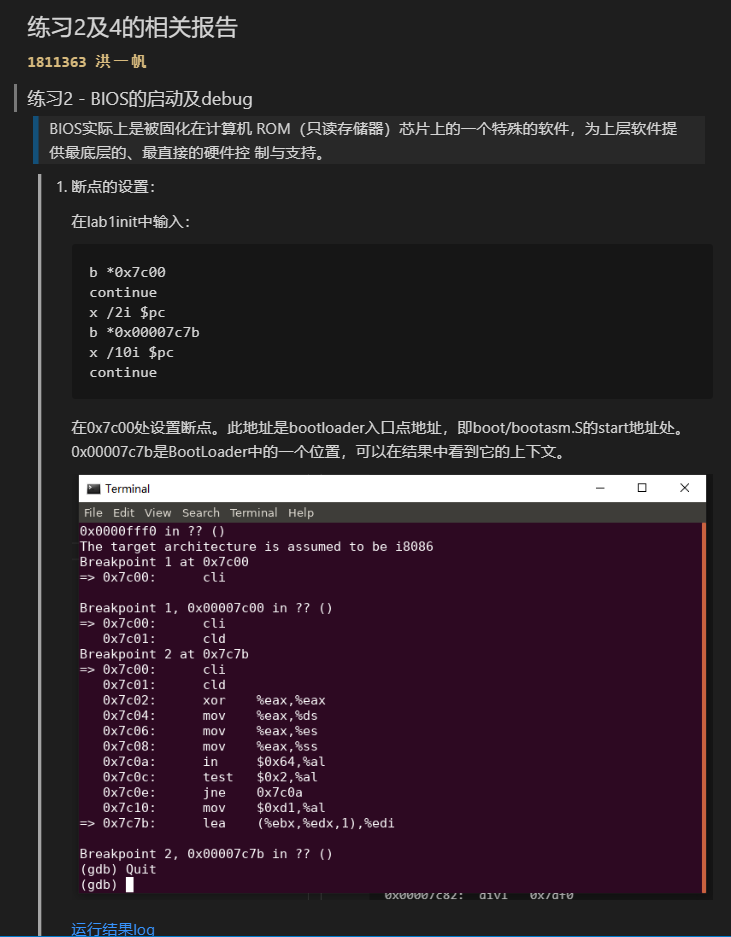
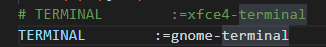

# OS LAB1 REPORT

[**`1811363 洪一帆`**]

[**`1811363 洪一帆`**]:bug_writer

[具体负责部分的文档内容可以查看result.md](result.md)

以下是文档截图

****

## `问题合集`

## wsl无法打开Makefile中的调试工具，是因为无法调用TERMINAL:=xfce4-terminal：
> 
> 解决：
>   - 安装虚拟机Ubuntu，但是因为系统自动更新导致之前的包版本不匹配。reinstall直接把系统给整崩了（好像是删除包的时候出现太多错误系统直接中断了）。心态炸了。。。。
>   - 通过wsl安装可视化界面gnome-terminal：但是装好后忘记改terminal参数然后一直报错。太蠢了。。
>   - 

## 无法进行Ubuntu和window之间剪切板的交互

> 只能通过截图来展示结果。

## 没有能够很好地理解BIOS启动过程中CS寄存器的值

>    一开电，启动的是实模式，早期是为了向下兼容。
>    
>    CS为F000H，EIP为FFF0H。将地址相加，得到BIOS的起始地址应该是1 EFF0H。
> 
>    但是文档里面说应该是FFFF FFF0H。感到很困惑。
> 
>    解决：
> 
> -   更多地查阅和理解：CS有一个shadow register，其值为FFFF，和EIP相加和得到正确的结果。
> 
> - **理论结合实践**
>    
>    可以从log中看到起始地址确实为FFFF FFF0H，并且执行了一个长跳转。
> 
> - 为什么要设置一个shadow register这样的机制--是为了更好地向前兼容。

## 写在最后
为了准备展示发现好麻烦啊，真的需要很仔细地去理解查阅各个知识点。但是确实收获了很多。
