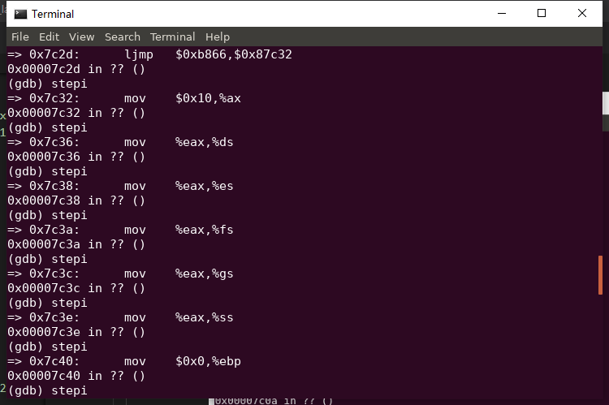
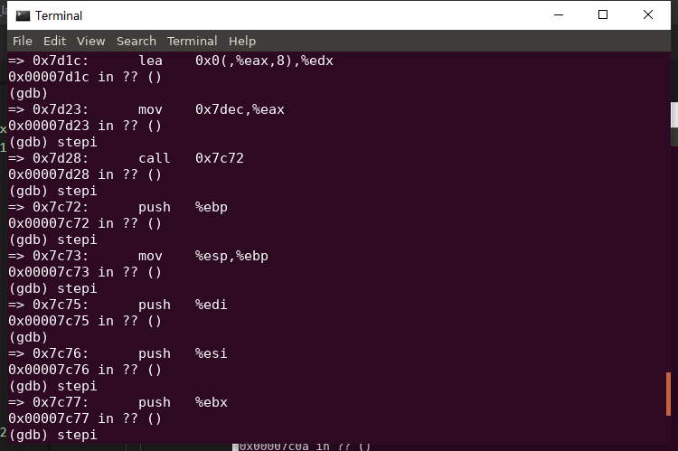
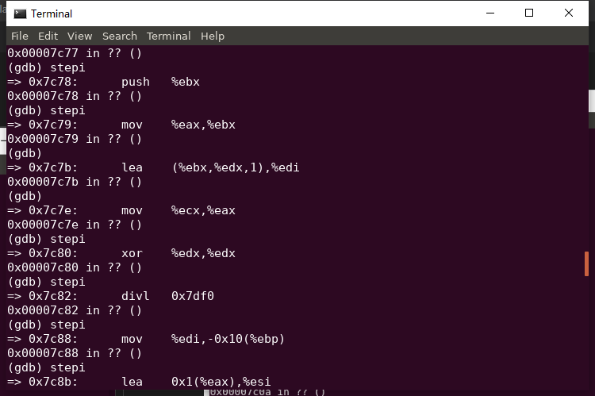

### 练习2

1. 断点的设置：
   
   在gdbinit中输入：b *0x7c00  
   在0x7c00处设置断点。此地址是bootloader入口点地址，可看boot/bootasm.S的start地址处
2. [运行结果查看](labcodes_answer/lab1_result/bin/q.log)
    
   
   
   
   
   
   

> 对于下列定义，反编译后直接用初始值代替符号，但是有些值会变化，比如PROT_MODE_CSEG
> ```s
> .set PROT_MODE_CSEG,        0x8     # kernel code segment selector
> .set PROT_MODE_DSEG,        0x10    # kernel data segment selector
> .set CR0_PE_ON,             0x1     # protected mode enable flag
> ```

> 2. BIOS 的启动和作用
> 
>
>> 学堂在线中：
>> 
>> 一开电，启动的是实模式，早期是为了向下兼容。
>>
>> CS指向F000H地址，里面存放了BASE基址，为FFFF0000H；
>> 
>> EIP（即offset）指向FFF0H。
>> 
>> 将地址相加，得到BIOS的起始地址FFFF FFF0H。
>>
>> 可以从log中看到起始地址确实为FFFF FFF0H
>> 
>> IN: 
0xfffffff0:  ljmp   $0xf000,$0xe05b
>> 然后BIOS加载存储设备（比如硬盘）上的第一个扇区内容（512byte）到0x7c00，启动BootLoader。（为了减小难度BIOS只加载一个扇区，靠BootLoader来加载ucore。）
> 
> 发现上面两种说法存在出入,并不是很清楚为什么会有这种区别。
> 
> 3. bootloader的启动和作用
> 
>> 3.1 从实模式启动保护模式(16位寻址空间编程32位）和段机制（但是段机制和后面的页机制功能重复，所以后来主要采用页机制来实现分块的功能）。


